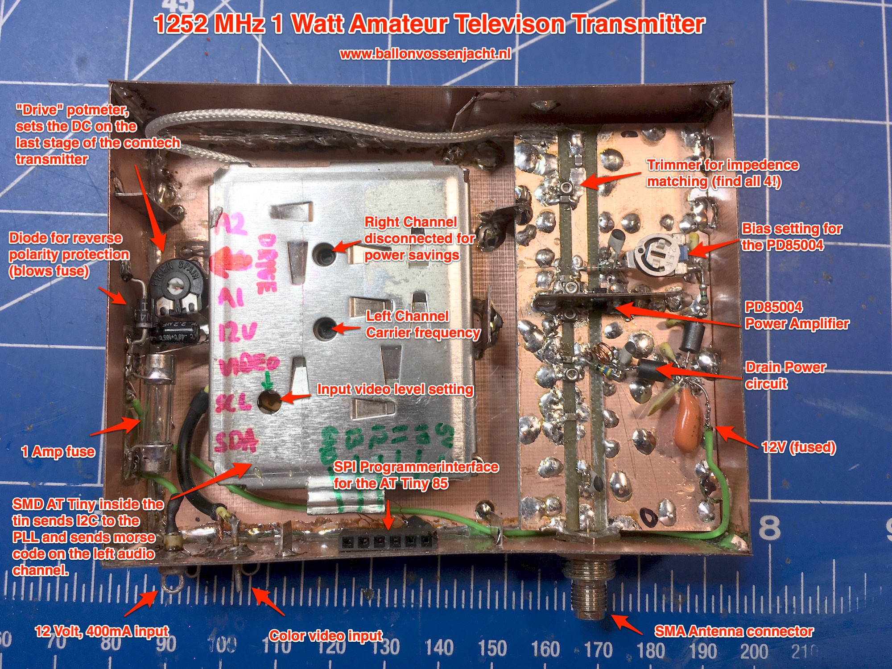
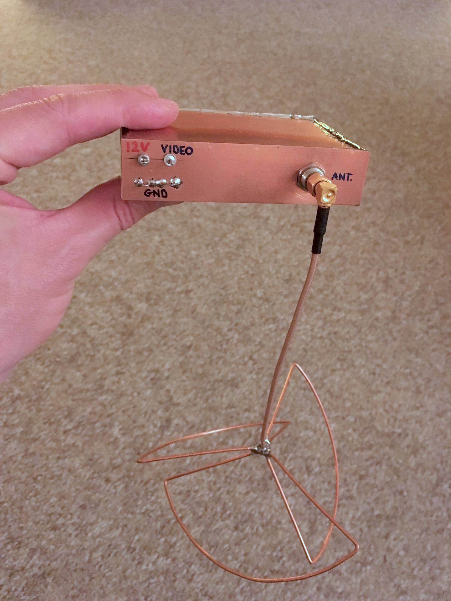
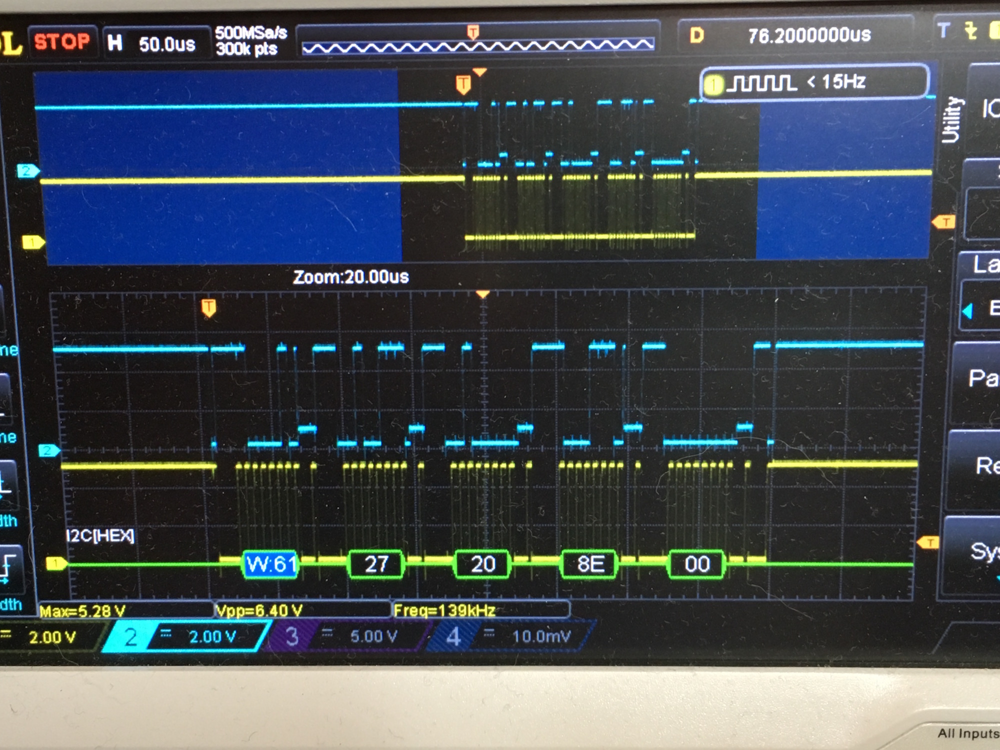

Balloon TV
==========

All done and ready to go, check the [project diary](documentation/diary.md).

This is a little project for adding an ATTiny 85 to a Commtech Video transmitter in order
to get it to transmit it on 1252MHz, and send out a CW (morse code) identifier on the 
audio channels. The transmitter is a quick and simple solution for the annual Dutch
Balloon Fox Hunt called [Landelijke Ballonvossenjacht](http://www.ballonvossenjacht.nl/)

- The [development guide](documentation/how-to-build.md) gives you information on how to
  build your own version of this project.
- The [datasheets directory](documentation/datasheets) contains all the data sheets and
  schematics I used to figure this out.
- The antenna is a simple .

A brief timeline with notes and funny stories can be found in the [project diary](documentation/diary.md).
I'll try to keep it updated with the latest info as much as possible.

TODO list
---------

In order of importance:
- [x] Create Arduino code for setting the frequency of the Comtech transmitter (using
      I2C to program the SP5055).
- [x] Create code for sending CW (morse code) over the audio channel of the Comtech.
- [x] Add microcontroler inside the comtech enclosure
- [x] Add SPI connector for external programming
- [x] Create lightweight cloverleaf antenna
- [x] Connect and test Video signal (send/receive)
- [x] Add output amplifier to the Comtech to create approx. 1.5 Watts of output power.
- [x] Make the whole setup water-proof.

Ideas and nice to haves (expected to be implemented for the 2017 version of the ATV transmitter)
- [ ] Video text overlay with callsign (and other info?). I2C teletext ICs are available
      for this.
- [ ] Temperature inside/outside as text overlay. I2C temperature sensor.
- [ ] Add the audio of the voice transponder in the balloon to the audio channels of
      the video.

The resulting transmitter before closing it up:

The transmitter and the antenna, ready to go into the balloon's pod:

      
And the image of the I2C communication between the ATTiny and the
SP5055:

