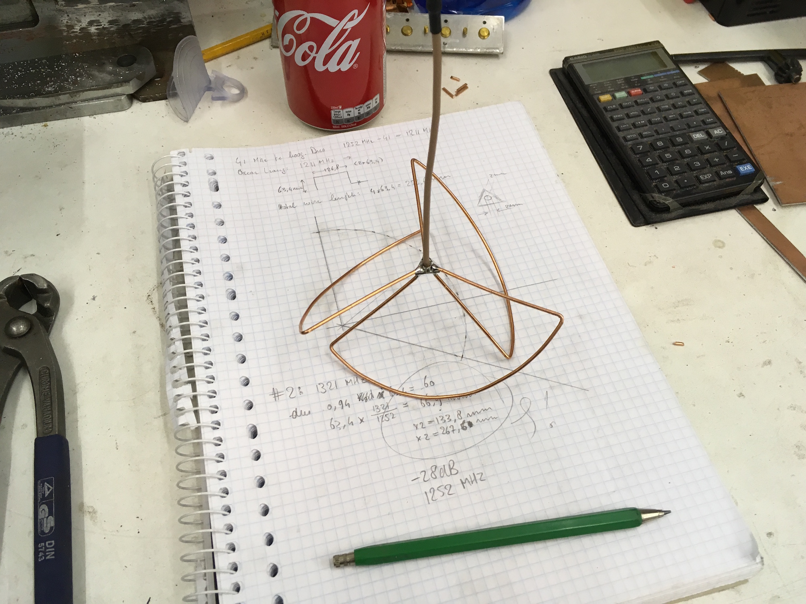
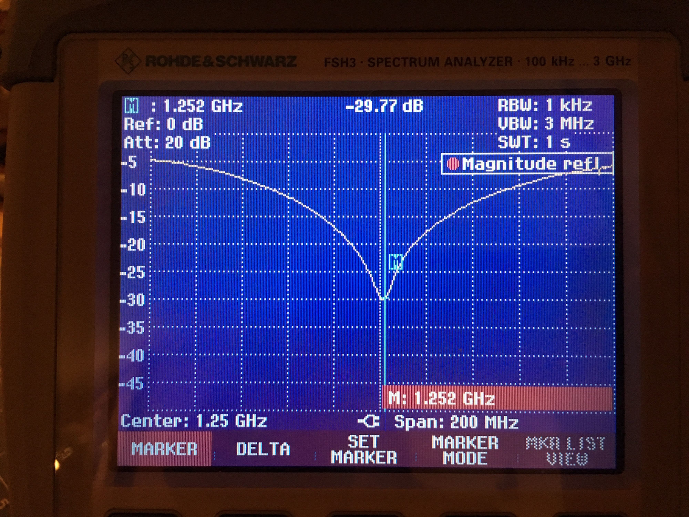

Building the Clover Leaf antenna
================================

Because the TV transmitter is hanging from a balloon, the old setup used a cloverleaf
antenna. This gives a radiation pattern in the form of a half sphere, pointing down. I am
told that the advantage is that the radials are in a 45 degree angle, and the field has
circular polarization in the vertical plane. Because the field is "both horizontally and
vertically polarized" (note the quotes), the receiver antenna can be in any position, and
there is less fading on the signal when the transmitter antenna tilts or turns in the wind.

For the new clover leaf antenna I used
[Oscar Lang's clover leaf calculator](https://oscarliang.com/make-diy-cloverleaf-antenna/)
to calculate the length and position of the elements. My first attempt resulted in an
antenna which resonated about 60 MHz higher than calculated. At these frequencies (1 GHz
and up), dimensions and material can make a lot of difference.

After changing the size and experimenting with the construction I came to an antenna which
resonates exactly at 1252 MHz, and has almost -30dB return loss:

The final version of the antenna has a PCB mounting point for the radials. This adds
capacity and throws the calculation of the resonant frequency off, but it was worth the
struggle:

![construction]](images/cloverleaf-construction.jpg)

The end result is of course covered in epoxy resin to make it waterproof. The radials are
made of regular copper wire. The wire was twisted with a hand drill compress the molecular
structure, which makes the wire more rigid. Thanks for the tip, [Remco](http://remco.org/)!

Of course, building an antenna like this would have been impossible without Mischa loaning
me a spectrum analyzer with a tracking generator covering these frequencies. Playing with
that tool was a lot of fun and I've definitely added that to my wish list :-)