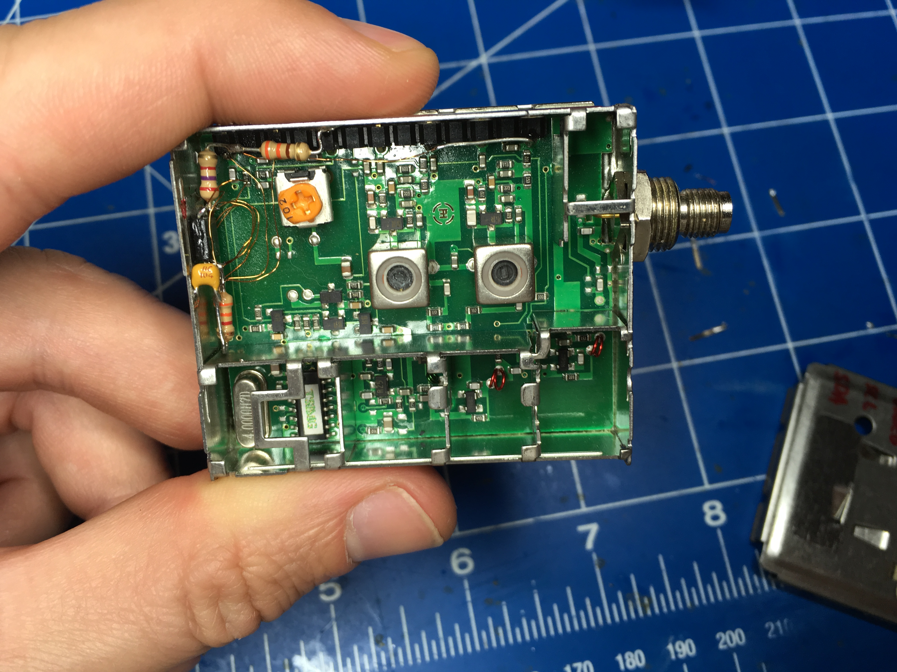
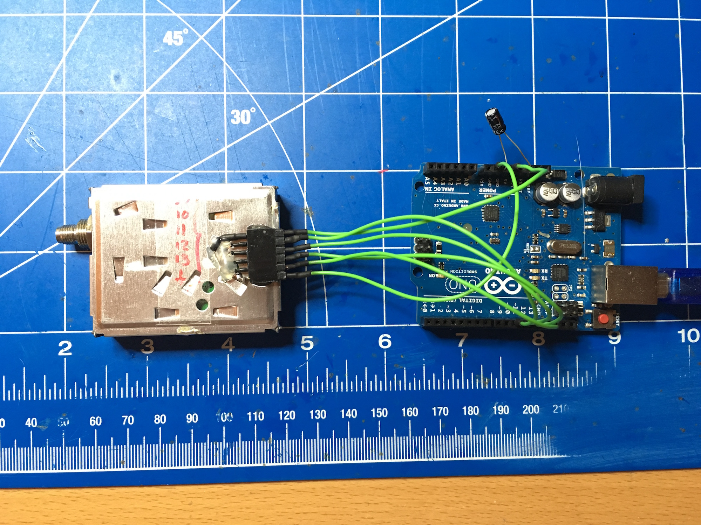
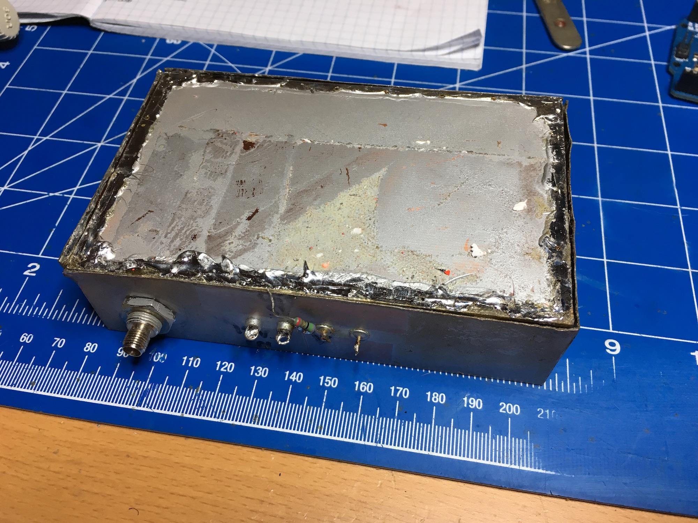
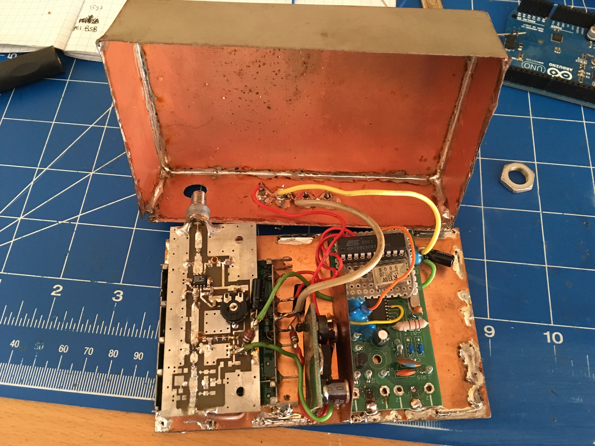
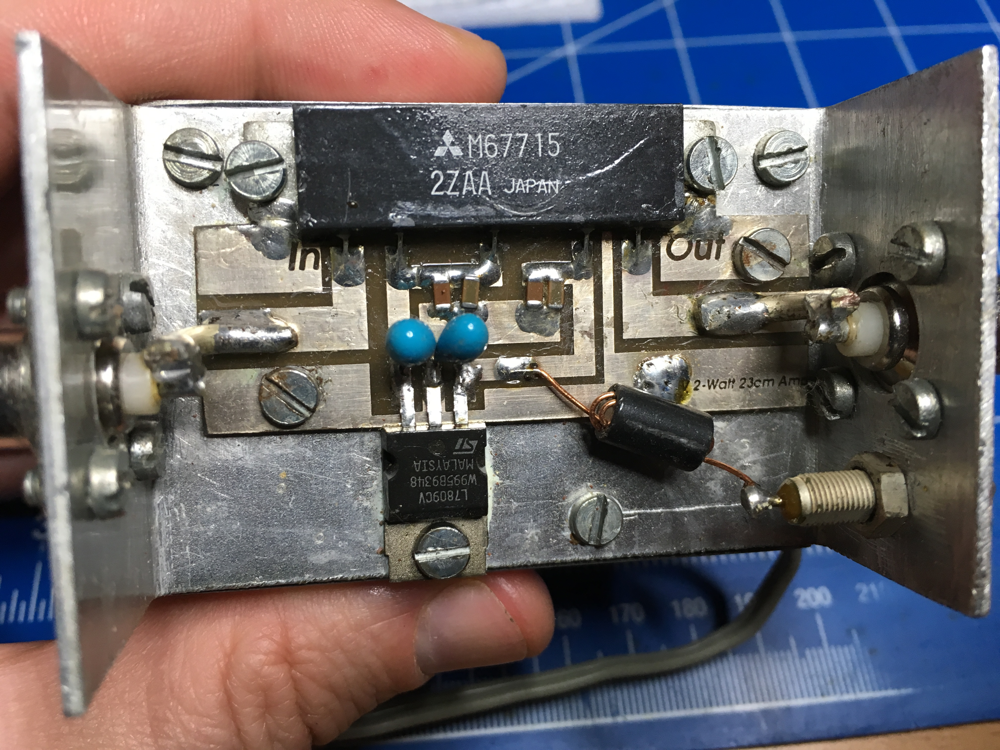
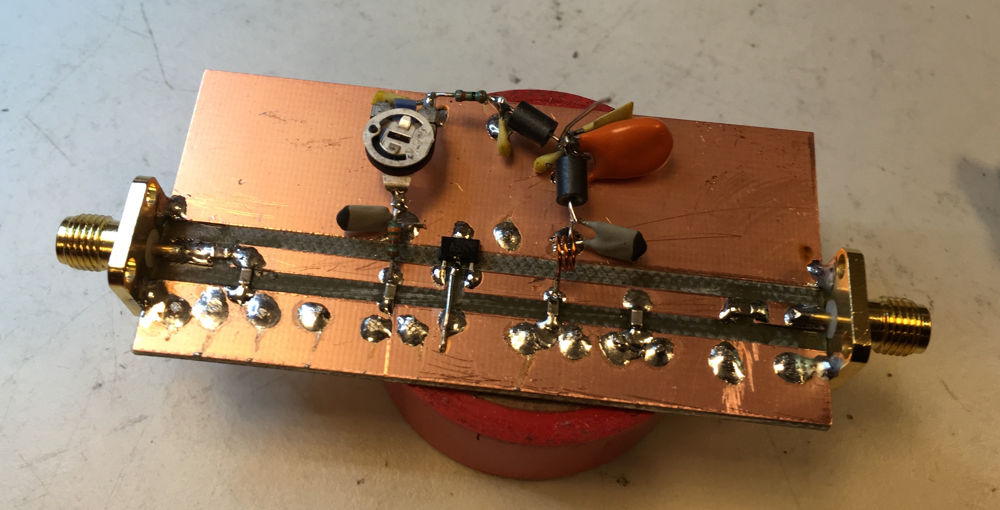
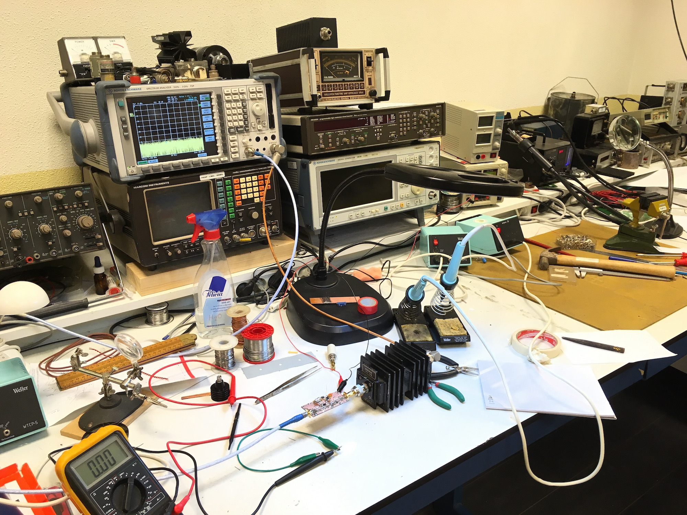
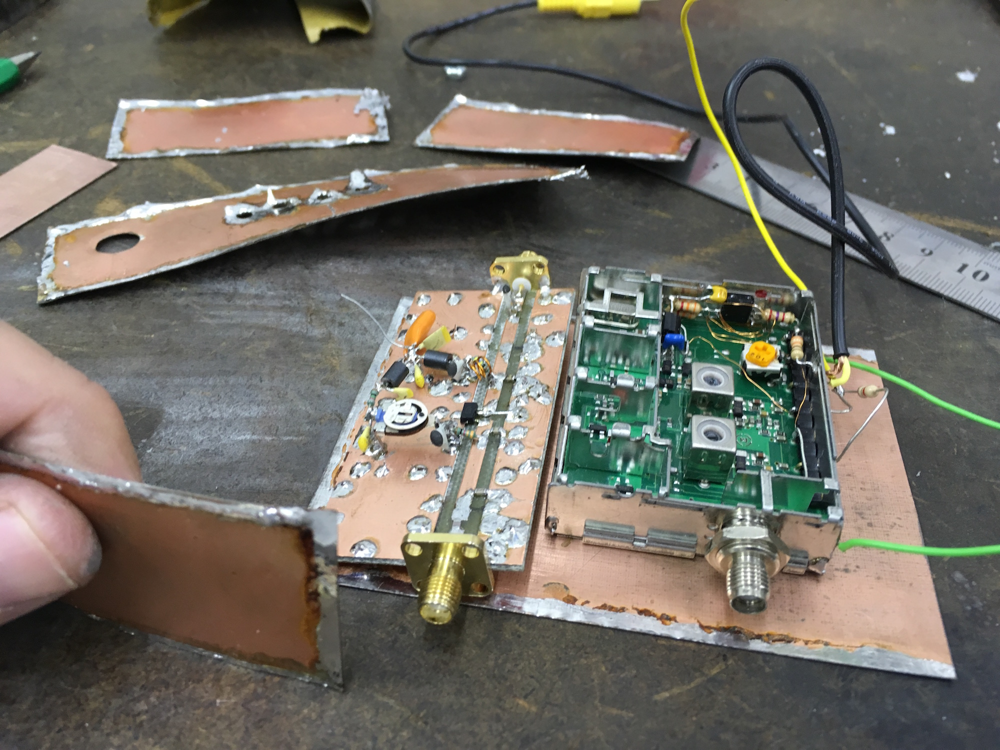
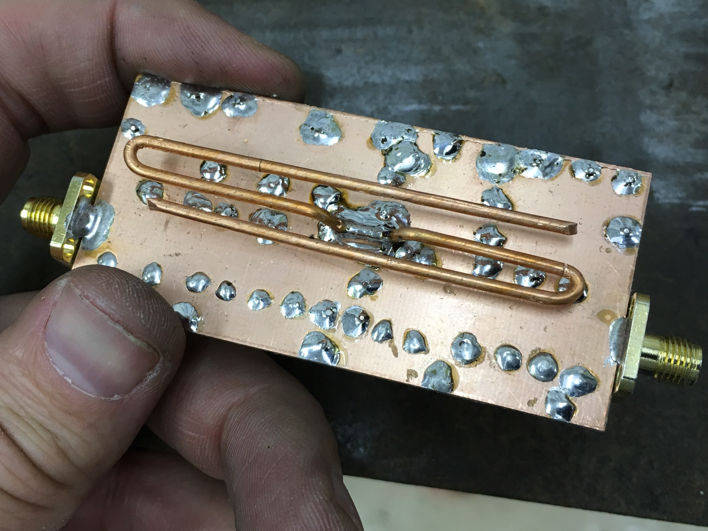

The project diary
=================

A list of funny notes and events of what happens on the project:

- 28 June project started, uploaded to github on https://github.com/realrolfje/balloontv
- 29 June Randy orders 23cm ATV transmitter
- 2 July IC selection based on weight, power usage, I2C capabilities and termperature
  stability. Ordered ATTiny45 and 85 in normal and SMD packages.
- 5 July Configured Arduino IDE with board info from highlowtech, found pin mappings
  (what is connected to what), created Sketch with square wave on pin 6 (D1) to measure
  temperature stability in the freezer when the ICs are delivered.
- 6 july Added I2C library, added code for programming the SP5055, and some pseudo
  code to calculate the divider.
- 7 july Tested the ATTiny 45 (8 pin DIL housing, 8MHz) for temperature stability. Code
  for flipping a pin every 1 mS, produces aa square wave.
  At room temperature: 525,0 Hz (with some jitter)
  After 45 minutes without power in a freezer, at -20 C: 515,2 Hz (with jitter, 4% slower).
  After 20 minutes under power in the freezer, back up to 516 Hz.
  After 4 more minutes under power in the freezer, back up to 517 Hz.
  Conclusion: Temperature instability will likely not be a problem in this application.
- 8 july I2C code added, screenshot of the oscilloscope showing data being transmitted,
  looking good so far.
- 10 july Added CW sounder on pin 1. Problem: Long strings don't fit the program memory.
  When using the original idea to do cwSendText("SOME TEXT HERE"), the program crashes,
  not producing sound or I2C. Sending all characters as separate cwSendCharacter(0B01100100);
  calls works. Although the current workaround works, it is not very neat code.
- 17 july Tighter code with lookup table for CW sending, uses slightly less memory.
  I2C + Long CW text working on SMD ATTiny85 (has more memory). Needs testing with the
  ATV transmitter and final tweaks and assembly. Looks like it can be inline programmed.
  Found a link to http://nootropicdesign.com/projectlab/2011/03/20/text-and-graphics-overlay/
  for video overlay.
  http://electronics-home-projects.tripod.com/
- 28 july Analyzed the I2C data on the commtech board. Does not look anything like I
  expected to see based on the SP5055 datasheet. Spoke to people who have experience with
  this board, and the mention that it also sends display data over I2C, which explaines the
  strange bytes I see.
- 31 july Fixed a few bugs in the code, burned it to the tiny and hooked it up to the
  SP5055 in the transmitter. Works like a charm. Next up: Couple the Audio for the CW
  into the left and right audio channels. Need to figure out what the level needs to be.
- 12 Aug Simon applied a cool pull request for freeing up program space by storing the CW
  lookup table in program memory. The old version uses bytes (22%) of dynamic memory, and
  the change frees up 38 bytes and reduces usage to 78 bytes (15%) of dynamic memory.
- 14 Aug Placed the ATTiny inside the comtech housing:
  
  And added an external SPI connector:
  
- 17 Aug A productive evening in Hilversum. Mischa brought the old 13cm ATV transmitter.
  This transmitter was used for years in the ballon. The outside the solder was already
  removed on this picture to open it:
  
  And this is the inside of that 13cm ATV transmitter:
  
  Maarten brought a complete 23cm Power Amplifier of which we need to remove the housing
  and cooling fan, and replace it with something more fitting (lighter and smaller).
  
- 18 Aug Measurements on the old 13cm ATV transmitter. Power usage is 500mA at 12V, and
  it weighs 170 grams.
- 20 Aug Tool the 23cm PA to [Frank](http://pe3frx.nl/) to get it working and do some
  measurements. It outputs well over 1 Watt, but it consumes over 1,5 Amp and the heatsink
  gets very hot. The battery and the styrofoam of the balloon will not be happy. We tried
  to get the old 13cm PA with the RF2126 working on 23cm. It produced 500mW before it
  stopped working. It seems to get too hot outside its operating frequencies. We need a
  new plan.
- 22 Aug Frantic mailing and calling got me into contact with Frans PE1FOT, administrator
  of [pa microwaves](http://www.pamicrowaves.nl). He had three [PD85004's](datasheets/pd85004.pdf)
  which I picked up that same evening so that we can build the driver of
  [G4BAO's 23cm PA](datasheets/driver_Build1_1.pdf) to use as 1 Watt PA. 
- 23 Aug Milling, drilling and soldering resulted in this PA:
  
  It oscillates like crazy at about 1220 MHz. Building the PA and fixing the oscillation
  tool all evening, and we effectively got kicked out of the radio club. Home at 01:30 in
  the morning.
- 24 Aug Fixed the oscillation by adding more through-holes at the ground points and
  between input and output circuits. Will measure and adjust output tomorrow.
- 25 Aug  Oscillation re-appears, and fixed again by even more through-holes, and finally
  got rid of it by connecting the drain to ground on the top side of the board as well as
  the bottom side of the board.
  Adjustments to the output circuit to get the power up resulted in 900mW output power and
  a very warm PD85004, which gave up on us at the end of the evening. Luckily, I have two
  spares but forgot to bring them with me.
  
- 27 Aug Because I have good hope to get the PA working this Tuesday at the club, I 
  started working on the housing, because we need that this week:
  
  Just to be sure I am also adding some makeshift cooling so that the PD85004 can dissipate
  its heat more easily:
  
