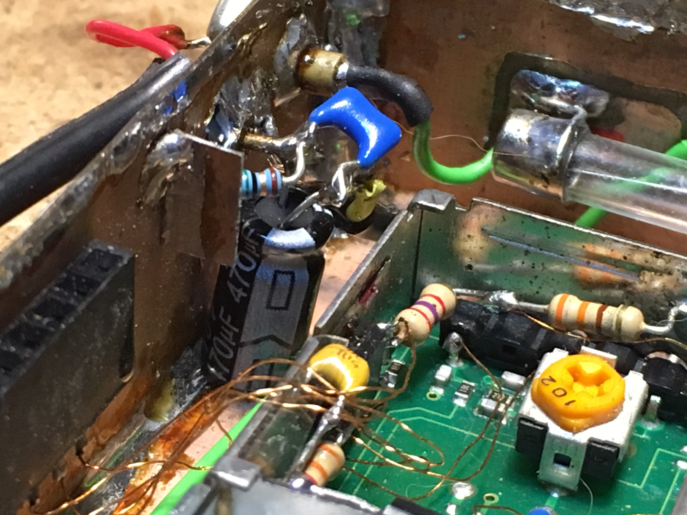

The project diary
=================

The [2016 diary is here](diary-2016.md)

A list of funny notes and events of what happens on the project in 2017:

- June/July: New plans! In an attempt to return to an actual radio direction finding event,
  the balloon needs to be ligther. Research is done to accomplish that. A lighter camera is
  one of the changes which might impact the balloon TV transmitter.
- 18 July: At the first organisation meeting the TV transmitter returns back to my desk,
  with a request to see if we make more improvements to the temperature stability. A can
  of freeze spray is on its way, because our freezer only goes to -22 degrees centigrade.
  Frank, our ATV expert is contacted to help with finding a solution to this problem. The
  important requirement is that it can not cost extra power or weight.
- 11 August: The big hunt for the cold problems. We started with freezing parts of the
  Comtech PCB and the amplifier. A bit of instability but not too much to worry about.
   
  Just to be sure we added some wax to the PLL and oscillator cans. Stability got a bit
  better but we still hadn't found the total power-off problems of last year.
  
  Poking and prodding, one of the capacitors fell off the power amplifier board. Bad solder
  joint. Carefully prodding further, we found that the coil for feeding the power amp was
  loose. Another solder joint gone bad.
  
  After fixing both solder joints the stability was much better. Cooling or tapping the
  transmitter gave less disturbance on the image and the signal.
  To further improve the image from the camera, Frank added a 75 Ohm terminating resistor
  and a 470uF electrolitic capacitor and 100nF ceramic capacitor. We also increased the
  video level a bit. This improved the sync detection on the receiver.
  
  We noticed that the audio of the CW sounded strange. It turns out that the Arduino IDE
  and/or gcc settings have changed in the past year, making the new compile of the same
  source code suddenly run 8 times faster. I increased delays and the CW now sounds normal
  again. The audio carrier of the transceiver is at 1258 MHz.
- 12 August: Point of no return: Closed up the transmitter.
  
  Added a (C.Q.) stamp, just to be sure ;-)