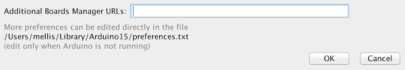
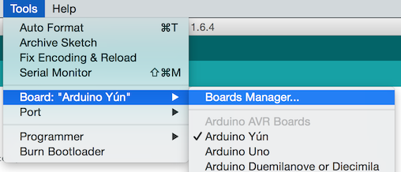
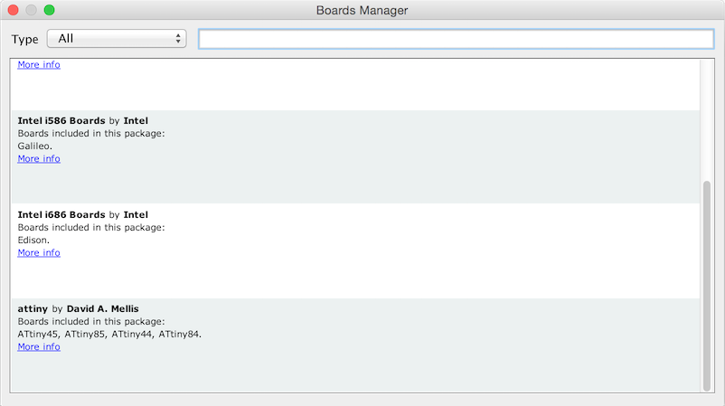
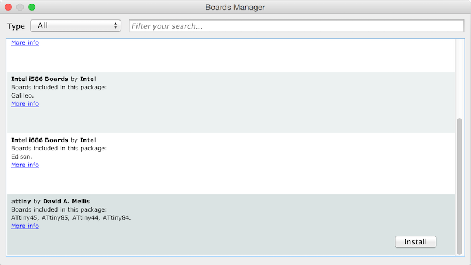
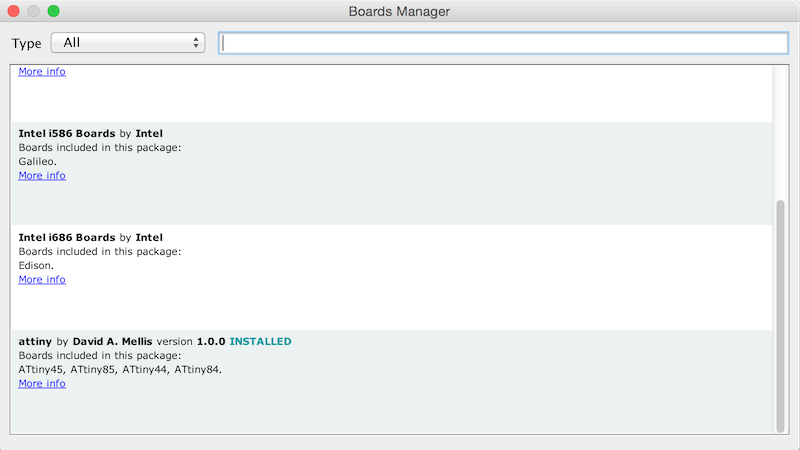
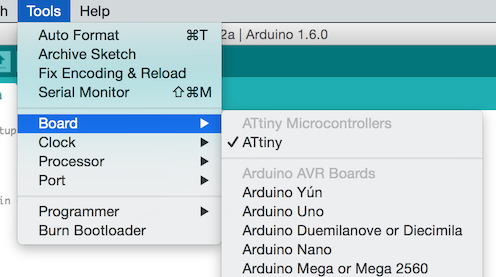

Building the Balloon TV project
===============================

If you have a commtech TV transmitter and an ATTiny 85 and want to build this project,
this document has everything you need.

Prerequisites
-------------
- A [Commtech TV transmitter](datasheets/Comtech_FM2400TSIM.pdf)
- [Arduino IDO 1.6.9](https://www.arduino.cc/en/Main/Software) with the
  [I2C library for ATTiny](http://playground.arduino.cc/Code/USIi2c) installed in the
  libraries folder.
- An [ATTiny](datasheets/Atmel-2586-AVR-8-bit-Microcontroller-ATtiny25-ATtiny45-ATtiny85_Datasheet.pdf)
- An [Arduino UNO or Nano](https://www.arduino.cc/en/Main/GenuinoProducts) (for some reason
  called "Genuino" by the Europe company branch, but don't worry, everybody calls it Arduino
  and that will likely not change.

Preparing your Arduino IDE
--------------------------
Install ITTiny library into Arduino IDE. Information from 
[the highlowtech blog](http://highlowtech.org/?p=1695):

In Arduino 1.6.4, you can install the ATTiny support using the built-in boards manager.

1. Open the preferences dialog in the Arduino software.
2. Find the “Additional Boards Manager URLs” field near the bottom of the dialog.
   
3. Paste the following URL into the field (use a comma to separate it from any URLs you’ve already added):
		https://raw.githubusercontent.com/damellis/attiny/ide-1.6.x-boards-manager/package_damellis_attiny_index.json
4. Click the OK button to save your updated preferences.
5. Open the boards manager in the “Tools > Board” menu.
   
6. Scroll to the bottom of the list; you should see an entry for “ATTiny”.
   
7. Click on the ATTiny entry. An install button should appear. Click the install button.
   
8. The word “installed” should now appear next to the title of the ATTiny entry.
   
9. Close the boards manager. You should now see an entry for ATTiny in the “Tools > Board” menu.
   
   
The code of this project uses I2C to talk to the SP5055 in the CommTech transmitter. Please
install The [I2C library for ATTiny](http://playground.arduino.cc/Code/USIi2c) to get this
working.

Preparing the Arduino UNO
-------------------------
Since the ATTiny does not have a USB interface, we're going to program it by using the
[Arduino UNO as a programmer](https://www.arduino.cc/en/Tutorial/ArduinoISP). To do that, 
connect the Arduino UNO to your Tiny as follows:

- Uno 5v to ATTiny pin 8
- Uno GND to ATTiny pin 4
- Uno pin 10 to ATTiny pin 1 (reset)
- Uno pin 11 to ATTiny pin 5
- Uno pin 12 to ATTiny pin 6
- Uno pin 13 to ATTiny pin 7

Then, add a 10uF capacitor over reset/gnd of the Uno.

Select the items in the Tools > Board and Serial Port menus that correspond to the board 
you are using as the programmer (not the board being programmed). Upload the ArduinoISP
sketch.

Preparing the ATTiny
---------------------
To turn the ATTiny into an Arduino, upload the bootloader to it.

1. From the Tools > Board menu, select Board ATTiny, Processor AT85 and clock 8MHz from
   the Tools menu in the IDE. The bottom right of the screen should now read
   "ATTiny 24/45/85, ATTiny85, Internal 8MHz on /dev/..."
2. Select "Arduino as ISP" in the Tools > Programmer menu.
3. Select Tools > “Burn Bootloader” command from the Tools menu.

Check for error messages. Your ATTiny should now have a bootloader on it, and you could
try to upload a blink sketch to it if you want to make sure it works.

Building and Programming
------------------------
Programming the code into the Tiny should be pretty straightforward: Load the sketch and
upload it using the Arduino Uno as ISP programmer. Check the connections in the header
of setfreq.ino for connecting the tiny to the commtech module. Use 4.7k resistors as pullups
for the SDA and SCL lines.

Additional info and tips
------------------------
If you like video tutorials, here's [David Watts programming an ATTiny85](https://www.youtube.com/watch?v=i9WOwDrpRKs)
